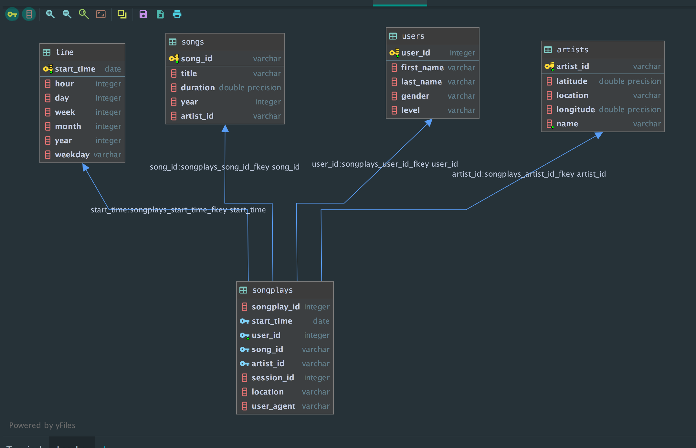

# Sparkify ETL

The objective of this is to model the user activity data for Sparkify, A music streaming app. The end goal is an ETL pipeline designed to optimize queries for understanding what songs users are listening to.

### Context
A startup called Sparkify wants to analyze the data they've been collecting on songs and user activity on their new music streaming app. The analytics team is particularly interested in understanding what songs users are listening to. Currently, they don't have an easy way to query their data, which resides in a directory of JSON logs on user activity on the app, as well as a directory with JSON metadata on the songs in their app.

### User Activity Data
There are two datasets contained in the data directory, there are
* Song datasets - can be found in `data/song_data` directory. 
* log datasets - can be found in `data/log_data` directory.

### Schema

The star schema was used for this project. The `songplays` table is the main fact table with references to 
other dimensional tables which are `time`, `songs`, `users`, `artists`

Why Relational database was used:\
    Relational database was used because we are certain the data structure is not changing and we won't be processing large data that will require using NoSQL.

### Project Structure
1. `test.ipynb` displays the first few rows of each table to let you check your database.
2. `create_tables.py` drops and creates your tables. You run this file to reset your tables before each time you run your ETL scripts.
3. `etl.ipynb` reads and processes a single file from song_data and log_data and loads the data into your tables.
4.  `etl.py` reads and processes files from song_data and log_data and loads them into your tables.
5. `sql_queries.py` contains all your sql queries, and is imported into the last three files above.
6. `README.md` provides details about this project.
7. `data` folder contains the dataset for sparkify 

### Steps
1. Implemented the required queries in `sql_queries.py`
2. Run `create_tables.py` and use the cells in `test.ipynb` to verify the tables are created correctly
3. Follow and implement the steps in `etl.ipynb` to mimic the pipeline process and insert the data into the respective table
4. implement the processes in  `etl.py`
5. Run the etl script `etl.py` in the terminal  and verify the output using `test.ipynb`

**NB:**  The `create_table.py` must be ran before running the etl script.
