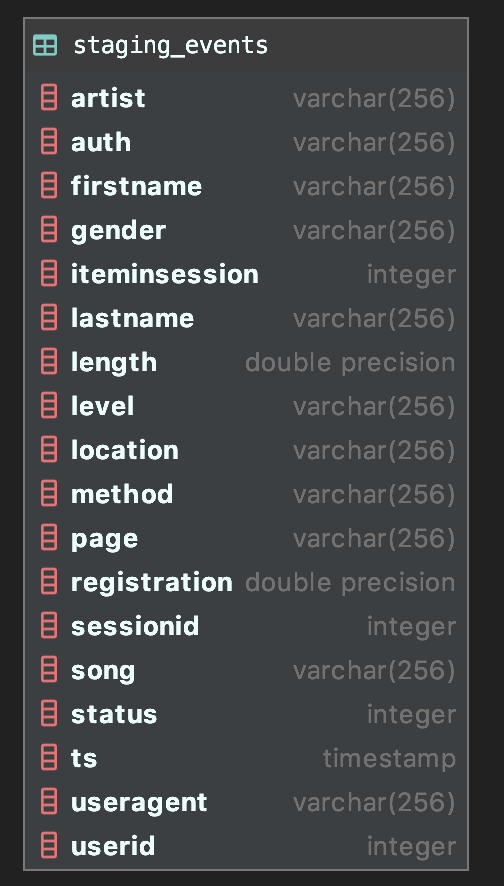
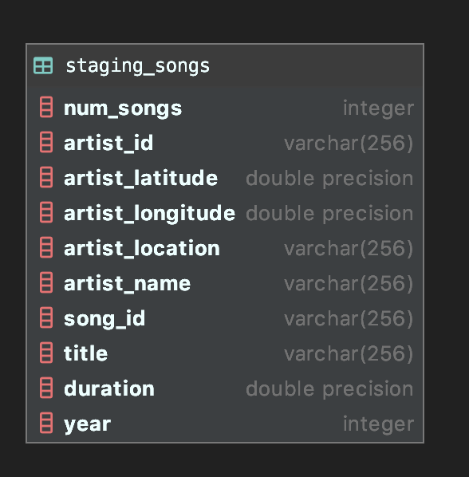
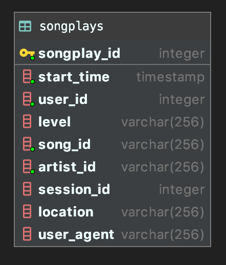
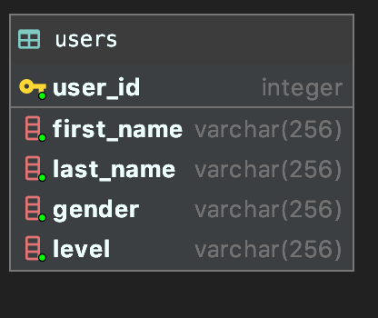
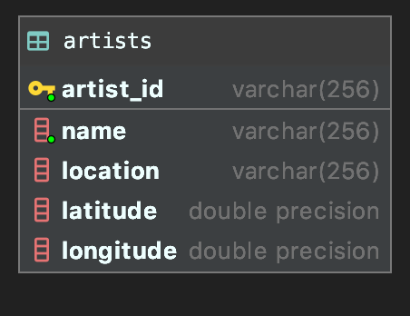
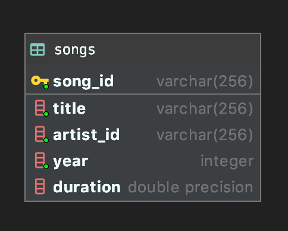
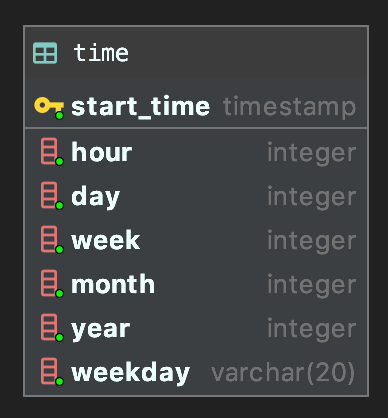

# Project Data Warehouse

## Project overview
Sparkify is a music streaming startup with a growing user base and song database. Sparkify want to move their processes and data onto the cloud.

Users activities and songs metadata data resides in json files in S3. 
The goal of the current project is to build an ETL pipeline that extracts their data from S3, 
stages them in Redshift, and transforms data into a set of dimensional and fact tables for their analytics team 
to continue finding insights in what songs their users are listening to.


## How to run
* Run `pipenv install` to create a virtual environment and install required dependencies.
* create a `dwh.cfg` file in the project `data-warehouse` directory with the following configuration.  
```
[IAM_ROLE]
ROLE_NAME='name of role to be created'
ARN='filled after creating role'

# filled after creating cluster
[CLUSTER]
HOST=
DB_NAME=
MASTER_USERNAME=
MASTER_PASSWORD=
DB_PORT=


[REDSHIFT]
DB_NAME='name of database to be created'
MASTER_USERNAME='root username'
MASTER_PASSWORD='root password'
PORT='default is 5439'
CLUSTER_TYPE=multi-node
NODE_TYPE=dc2.large
NUMBER_OF_NODES=2
CLUSTER_IDENTIFIER='name of cluster to be created'

[AWS]
ACCESS_KEY_ID=
SECRET_ACCESS_KEY=
```
* run `python redshift_setup.py --create CREATE` to create role and setup redshift cluster.
* run   `python create_tables.py` to create staging, dimension and fact tables.
* lastly, run `python etl.py` to load data into the tables.
* To tear down the setup, run `python redshift_setup.py --destroy destroy`.  

## Database Schema
### staging tables  
* staging_events  
  
* staging_songs  
  
### Fact tables
* songplays - records in event data associated with song plays i.e. records with page NextSong  
  
### Dimension tables
* users - users of the app  
  
* artists - artists of songs in app database  
  
* songs - songs in the app database  
  
* time - timestamps of records in songplays broken down into units  
  


